# 快速入门

## 安装Python

为了让计算机能够执行Python代码，我们需要Python解释器，从官网上下载的Python中内置解释器。

Python官网地址：https://www.python.org/

##### 进入官网，点击Downloads，选择对应的操作系统。

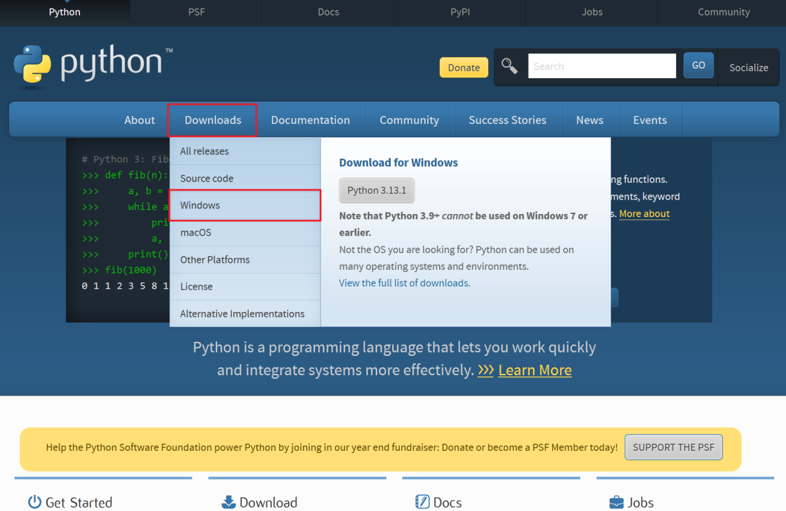

##### 选择版本，点击链接下载，我们这里的版本是3.12.8。


这里主要有两类安装包

“install” 安装包

最常见的用于在桌面系统、服务器等常规环境中完整安装 Python 的方式。无论是开发者想要搭建一个本地的开发环境用于 Web 开发、数据分析，还是普通用户希望在电脑上运行一些基于 Python 的脚本程序，都会选择这种安装包。比如，你要在个人电脑上使用 Python 结合 Django 框架开发一个网站，那就需要下载常规的 “install” 安装包，安装完成后系统会自动配置好各种环境变量、关联文件类型等，方便后续开发使用。

通常包含完整的 Python 标准库、解释器以及一些辅助工具（如 pip 用于安装第三方库）等。以 Python 3.10 的 “install” 安装包为例，安装完成后占用的磁盘空间相对较大，一般可能达到几十兆甚至上百兆，这是因为它要确保用户在各种常规开发场景下所需的功能都一应俱全，能够 “开箱即用”。

安装过程相对复杂一些，对于 Windows 系统，会自动设置系统环境变量 PATH，安装目录下会有完整的 bin、include、lib 等文件夹结构，用户安装完成后可以直接在命令提示符（CMD）或者终端中输入 “python” 命令启动解释器，使用 “pip install” 命令安装第三方库也非常便捷。

“embeddable” 可嵌入安装包

主要设计用于将 Python 嵌入到其他应用程序中。例如，有一款用 C++ 编写的图形处理软件，开发者想要为其添加一些脚本扩展功能，允许用户通过编写 Python 脚本来实现个性化的图像处理操作，这时就可以使用 “embeddable” 安装包。将 Python 以一种精简、可控的方式嵌入到已有软件中，避免引入过多不必要的组件，同时又能利用 Python 的强大功能。

它只包含最核心的 Python 解释器以及一些必要的基础组件，不包含完整的标准库。其目的是在嵌入其他应用时尽量减少冗余内容，所以文件大小通常只有几兆，方便集成到其他应用程序中，而不会大幅增加宿主应用的体积。

它不会像常规安装包那样自动配置系统环境变量。在嵌入应用程序时，开发者需要手动进行一些设置，比如指定 Python 解释器的路径，根据需求选择性地引入部分标准库等。使用方式更多是从宿主应用程序内部调用 Python 的功能，而不是像常规安装包那样供用户直接在系统层面独立使用。

综上所述，选择使用哪种 Python 安装包取决于具体的需求，是要搭建一个通用的开发环境，还是将 Python 功能巧妙地嵌入到已有应用之中。很明显我们属于第一种情况，所以选择Install安装包。

##### 双击下载好的文件，开始安装。


##### 保持默认，点击Next。


##### 修改安装路径，其他保持默认，点击Install开始安装。

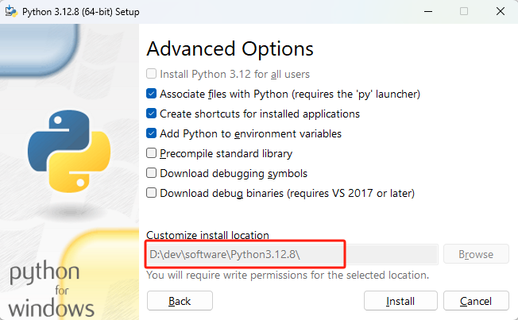

##### 点击Disable python length limit，点击close，完成安装。

禁用系统的路径长度自动限制，以避免因路径过长而导致的错误


##### 安装完成后检查是否安装成功。同时按下 Win键 和 R ，输入 cmd ，点击确定，进入命令提示符。


##### 输入python --version，打印出Python版本，安装成功。

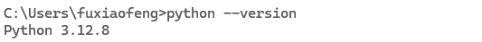

## 安装PyCharm

### 什么是IDE

集成开发环境（简称：IDE；英文名：Integrated Development Environment ）是用于提供程序开发环境的应用程序，一般包括代码编辑器、编译器、调试器和图形用户界面等工具。集成了代码编写功能、分析功能、编译功能、调试功能等多种功能。

虽然我们也可以使用记事本编写代码，并通过命令行调用Python解释器来执行Python程序。但这样比较繁琐，会降低开发效率。而使用IDE后，很多工作可以交给IDE帮我们去做，让我们可以专注于代码的编写。

Python的IDE我们选择使用PyCharm。

### PyCharm下载

PyCharm官方地址：https://www.jetbrains.com/pycharm/download

进入官网，点击左下角下载PyCharm安装包，专业版可试用30天，社区版完全免费。


### PyCharm安装

##### 双击安装包进入安装。

##### 点击下一步。


##### 修改安装目录，点击下一步。

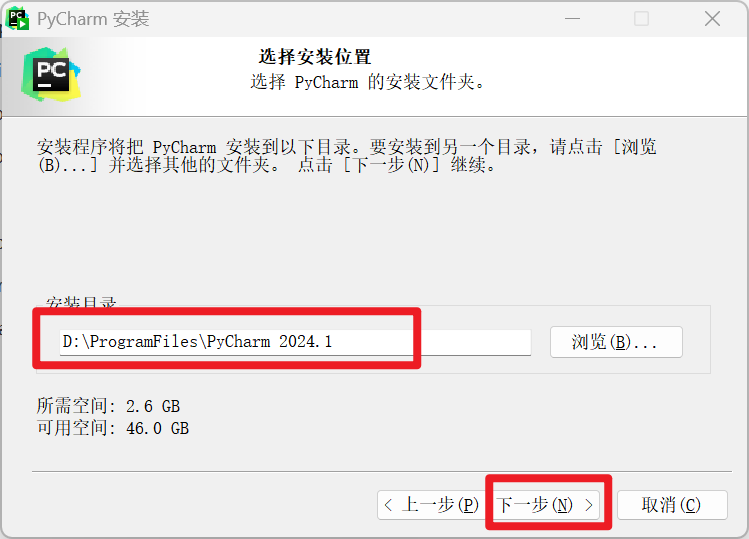

##### 酌情勾选安装选项，之后点击下一步。

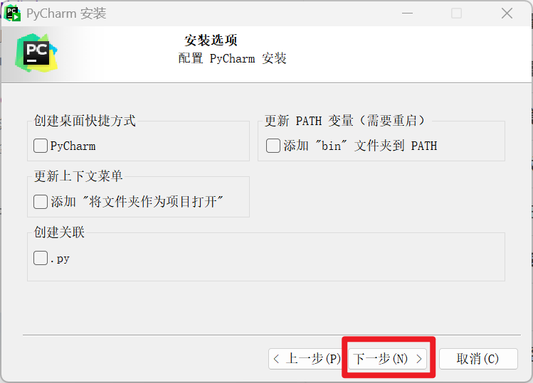

##### 点击安装。


##### 安装完成。

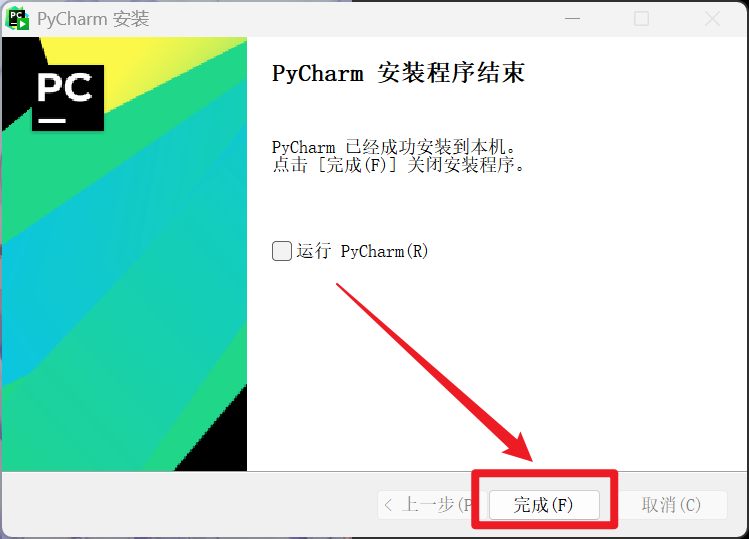


### PyCharm设置

#### 创建新项目

##### 点击 New Project 创建新项目。

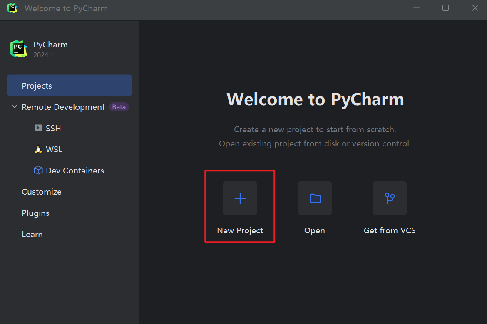

##### 设置项目名称，项目路径，解释器类型，Python版本。

注意：不同的pycharm版本，看到的界面会略有不同


解释器类型说明：

Project venv:

当前项目的虚拟环境，python版本可以在右侧小箭头下拉选择，在当前项目内安装的包只会在项目内有效，在项目目录下会有一个.venv目录。

Base Conda:

Anaconda环境，Anaconda是一个集成了大量python包的python环境，如果选择这个需要先在电脑内安装Anaconda。

Custom environment：

自定义环境，可以：

generate new新建虚拟环境（选择本机已安装的python或下载新的python作为BasePython）

generate new表示为新项目基于你所选择虚拟环境中的python作为Base python生成一个虚拟环境，生成后放在其项目文件夹下的venv中，使用venv作为解释器。这里所选择的虚拟环境中已安装的第三方库并不会出现在新生成的项目下的venv中，可以说只是将已安装的虚拟环境下的python复制了一份到项目下的venv中，所有需要使用的第三方库都需要重新安装。它可以脱离系统安装的python独立运行，它对于自身venv的修改也只影响它自身。当然它的基础虚拟环境是基于Base python进行建立的,所以使用conda在其Basepython中安装第三官方库对这里新建的项目环境没有影响

Select existing选择已配置好的虚拟环境

Select existing表示选择已安装的虚拟环境作为自己的编译器，并不会在项目文件夹下产生项目本身的venv，所选择的虚拟环境中的所有已安装的第三方包都可以使用，而不用重新安装。

##### 一个Python项目创建成功。

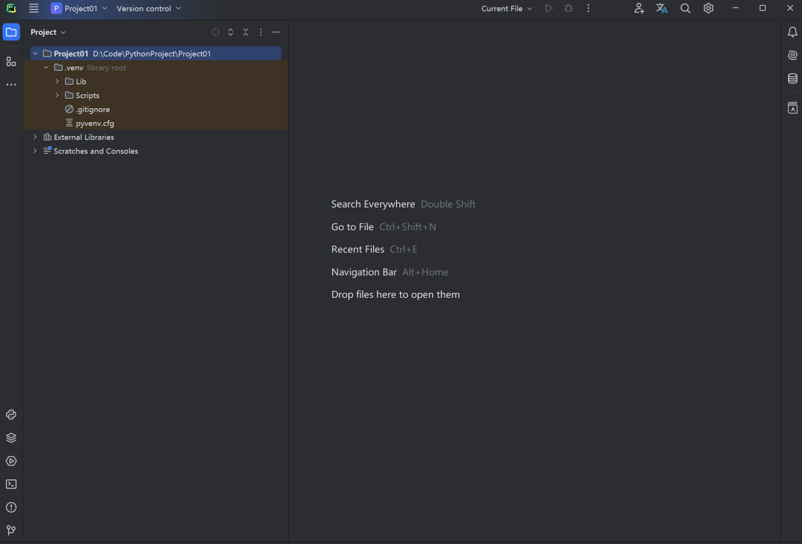

#### 主题设置

##### 打开设置面板

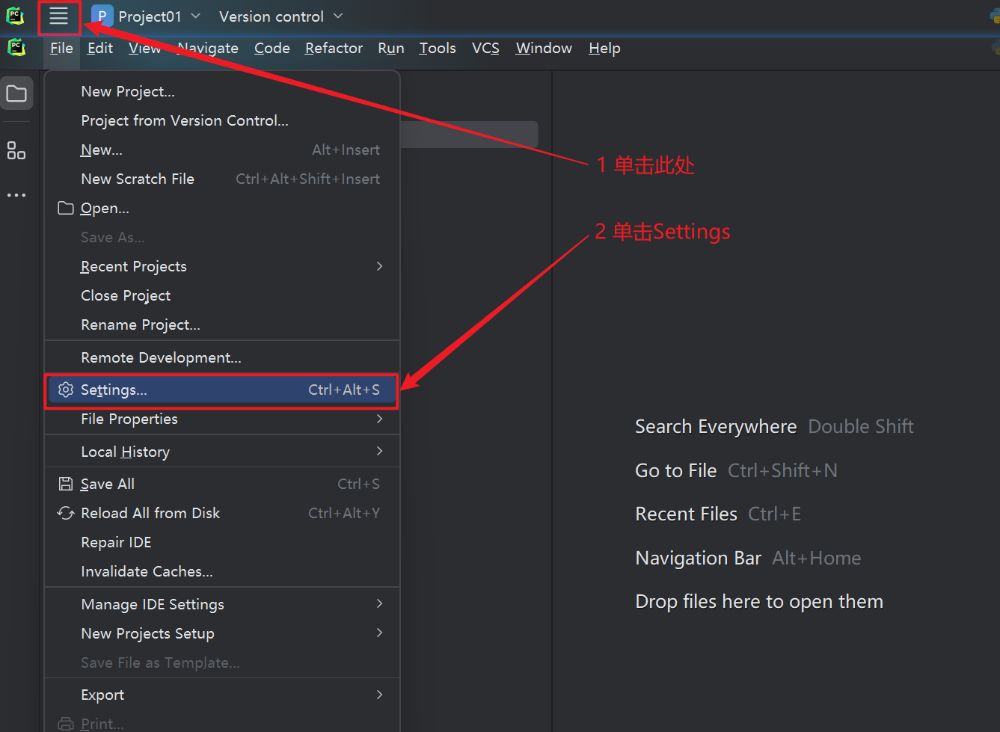

##### 进入Appearance&Behavior->Appearance，修改主题


#### 字体设置

##### 进入Editor->Font设置字体

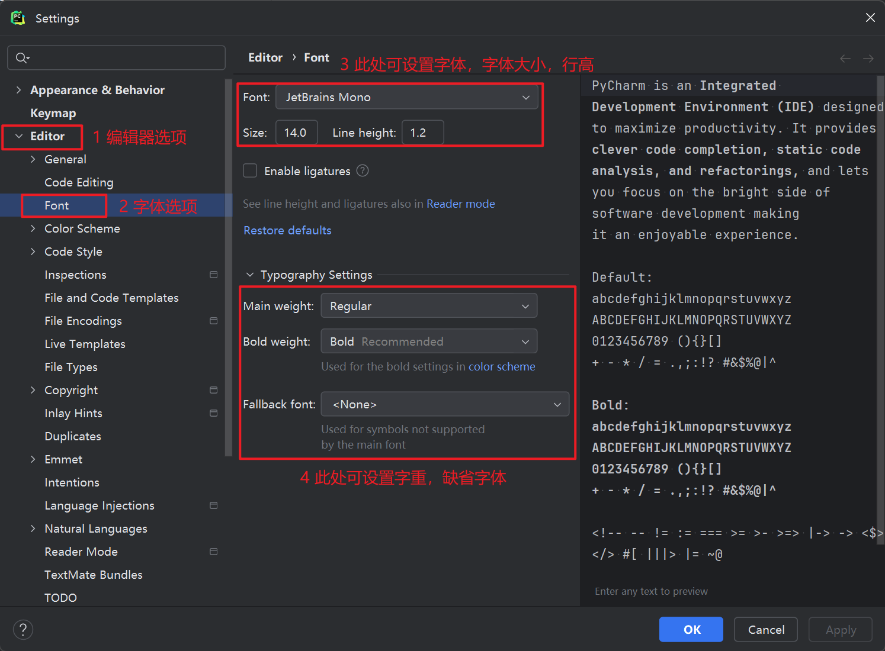

#### 中文设置，建议使用默认的english

##### 首先确认已经安装了中文语言包

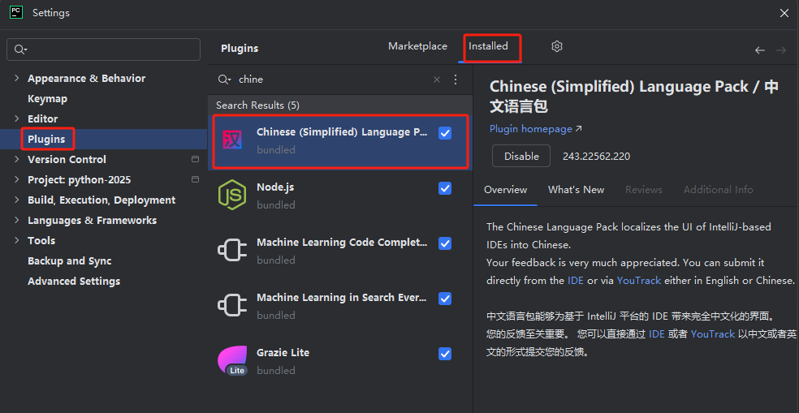

##### 切换简体中文


#### 快捷键设置

##### 在Keymap下可对快捷键进行设置。

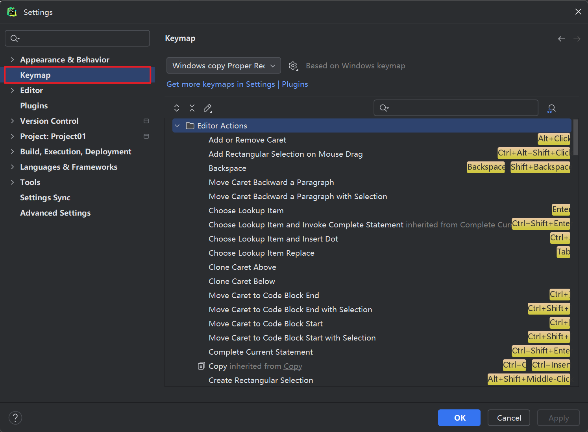

##### 常用快捷键：

| 快捷键 | 说明 |
| --- | --- |
| Ctrl + / | 行注释（可选中多行） |
| Ctrl + Alt + L | 代码格式化 |
| Ctrl + C | 复制当前行或选定的代码块到剪贴板 |
| Ctrl + D | 复制并粘贴当前行或选定的代码 |
| Ctrl + Z | 撤销上次操作 |
| Ctrl + Y | 可选为删除当前行或重做 |
| Ctrl + X | 剪切整行或选中代码 |
| Ctrl + = / - | 展开/折叠当前代码块 |
| Ctrl + Backspace / Delete | 向前/向后删除一个单词 |
| Ctrl + W | 选中单词或代码块 |
| Ctrl + [ / ] | 移动到行首/行尾或代码块起始/末尾 |
| Ctrl + Shift + ↑ / ↓ | 将当前行或当前方法上移或下移 |
| Ctrl + F / R | 查找/替换 |
| Tab / Shift + Tab | 缩进/反向缩进当前行（可选中多行） |
| Shift + Enter | 换行，光标不在结尾处也可换行 |
| Alt + ↑ / ↓ | 光标上移或下移到另一个方法 |
| Alt + Shift + ↑ / ↓ | 将当前行上移或下移 |
| Alt + J | 选中相同代码 |
| Ctrl + P | 查看方法传参 |

## 第一个Python程序

### Python程序运行方式

有多种方式执行Python程序，以下是常见的三种方式：

- 交互式命令行模式

- 脚本模式

- 集成开发环境（IDE）模式

### 交互式命令行模式

##### 同时按下 Win键 和 R ，并输入 cmd ，进入命令提示符。

##### 在命令提示符中输入python，进入Python交互模式。

##### 输入print(“hello”)，按下回车，控制台会打印hello。

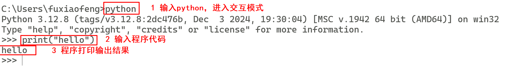

### 脚本模式

##### 在 E:\\Hello 路径下新建一个文件，将其重命名为 hello.py 。

##### 双击此文件，选择使用记事本打开，在其中写入print(“hello”)，并保存。

##### 在资源管理器上方输入 cmd 并回车，就会打开命令提示符并进入当前路径。或先打开命令提示符，再输入E: && cd Hello进入 E:\\Hello 路径。

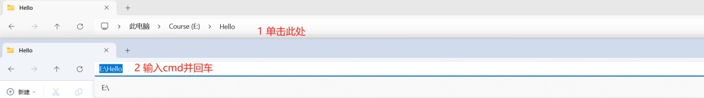

##### 在命令提示符中输入python hello.py执行程序。

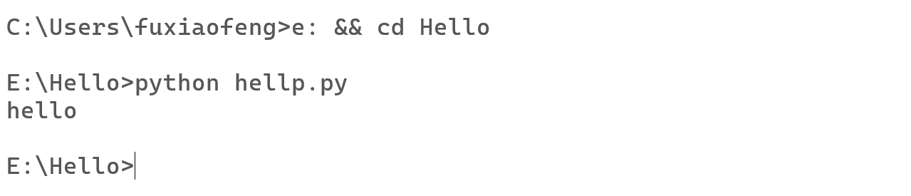

### IDE模式

使用IDE运行Python程序，也是日后我们最常用的方式。

##### 在python-2025项目下创建一个新的目录chapter02

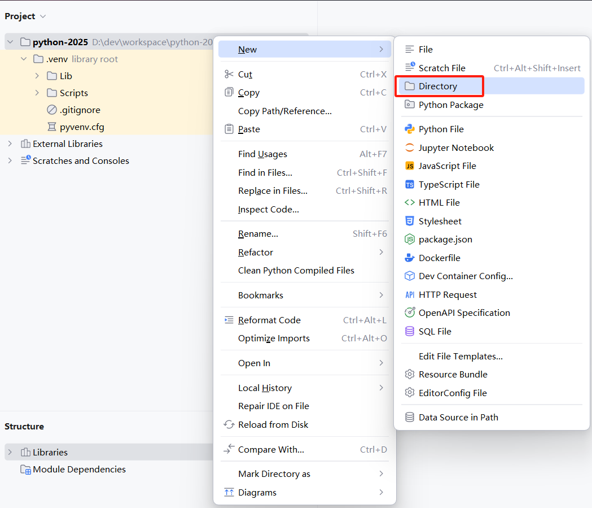

##### 在chapter02目录下创建一个Python程序文件，输入

```python
print("hello world")
```


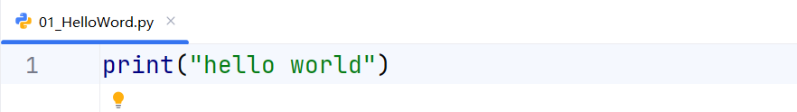

##### Pycharm工作区空白处右键，单击 Run‘01_Hello_World’。

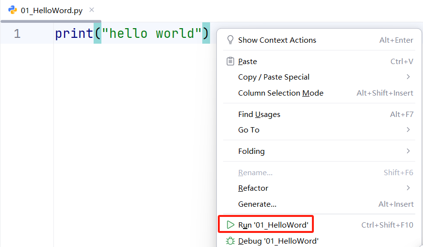

##### 可以在下方控制台看到程序执行结果，打印出了 hello world 。

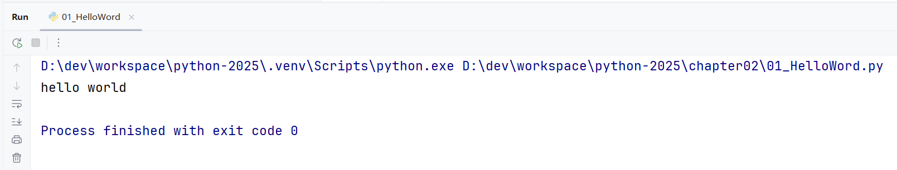
