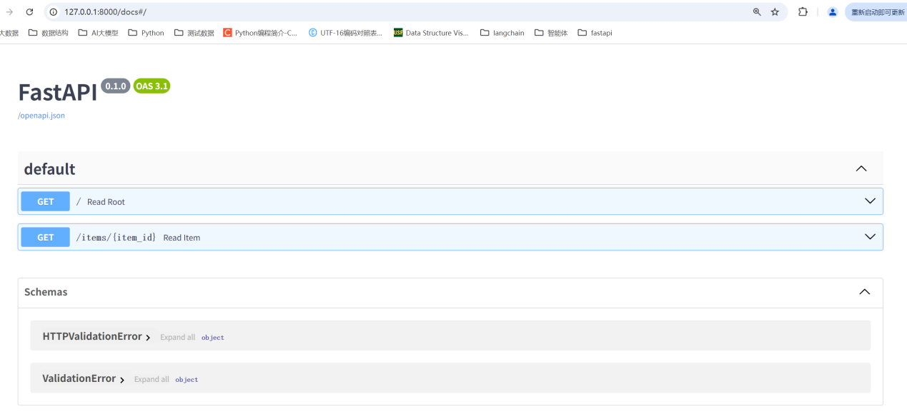
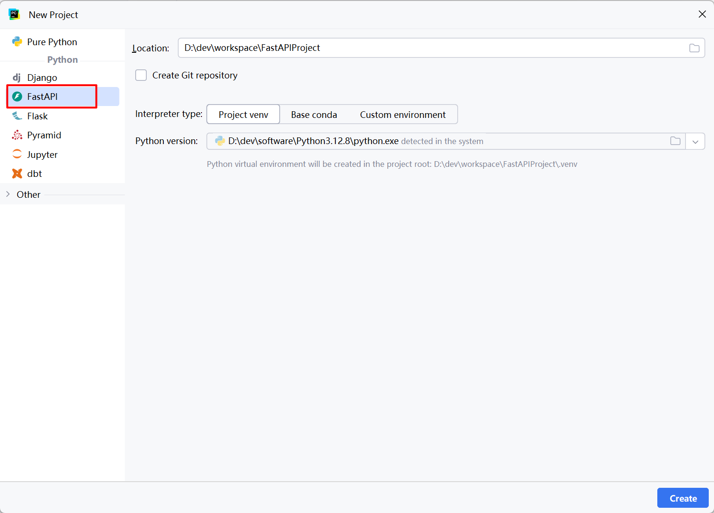
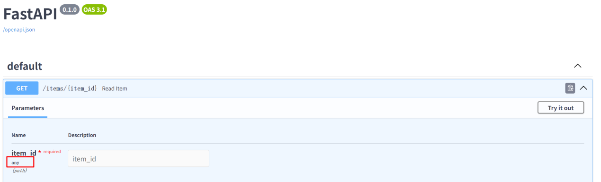
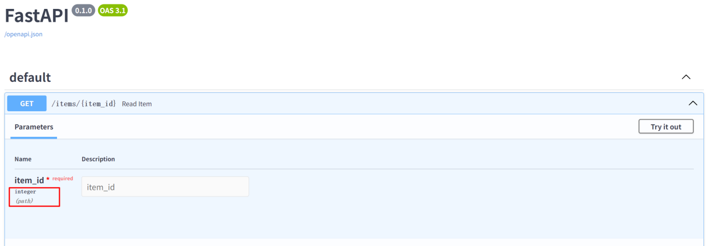
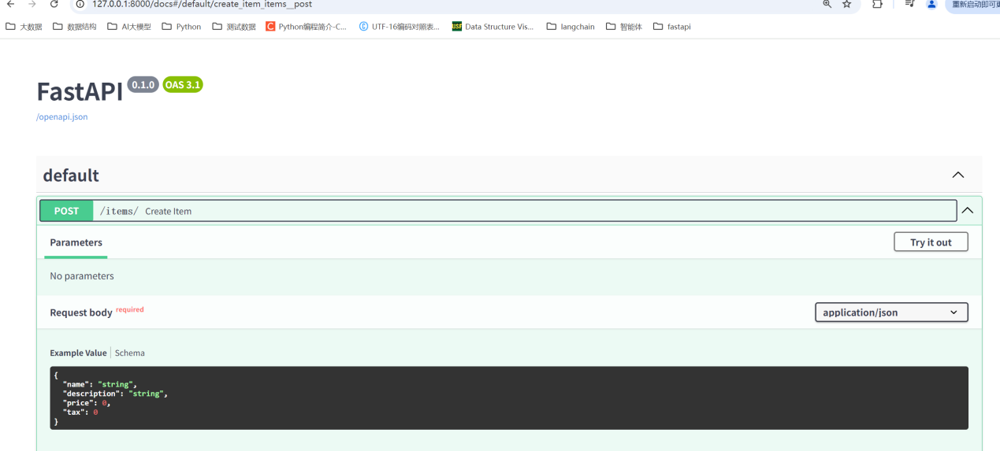
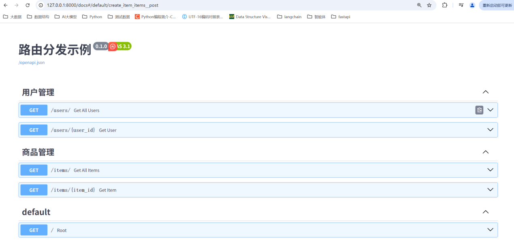

# FastAPI

## FastAPI介绍

FastAPI 是一个现代、快速（高性能）的Web框架，用于构建API。是建立在Starlette 和Pydantic基础上的。它基于Python 3.7 +的类型提示（type hints）和异步编程（asyncio）能力，使得代码易于编写、阅读和维护。FastAPI 具有自动交互式文档（基于 OpenAPI 规范和 JSON Schema）、数据验证、依赖注入（Dependency Injection）等功能，这些功能使得 API 的开发速度更快、更可靠。

文档： https://fastapi.tiangolo.com

源码： https://github.com/fastapi/fastapi

## 第一个FastAPI程序

### 创建新的项目


### 安装依赖

```bash
pip install fastapi
pip install uvicorn
```

### 创建一个 main.py 文件并写入以下内容:

```python
from fastapi import FastAPI

app = FastAPI()

@app.get("/")
def read_root():
    return {"Hello": "World"}

@app.get("/items/{item_id}")
def read_item(item_id: int, q: str | None = None):
    return {"item_id": item_id, "q": q}
```

函数前没有加async（同步函数）：

本质：定义一个普通的同步函数，不能在内部使用 await，所有操作都会阻塞当前线程直到完成。

适用场景：函数内部是纯计算逻辑（无 I/O 操作），或使用的库只有同步实现（如某些旧的数据库驱动）。

执行机制：FastAPI 会将同步函数自动放入线程池执行（默认线程池大小为 os.cpu_count() * 5），因此多个同步请求会被分配到不同线程并行处理，不会完全阻塞所有请求，也就是说，可以同时处理多个请求并发，但是在单个线程上，还是会阻塞的。另外当同步操作耗时过长（如秒级）时，还会因线程池耗尽导致后续请求排队。

### 在pycharm终端中通过以下命令运行服务器

```bash
uvicorn main:app --reload
```

uvicorn main:app 命令含义如下:

main：main.py 文件（一个 Python "模块"）。

app：在 main.py 文件中通过 app = FastAPI() 创建的对象。

--reload：让服务器在更新代码后重新启动。仅在开发时使用该选项

### 浏览器查看效果

使用浏览器访问 http://127.0.0.1:8000/items/5?q=iphone17 。

你将会看到如下 JSON 响应：


你已经创建了一个具有以下功能的 API：

通过 路径 / 和 /items/{item_id} 接受 HTTP 请求。

以上 路径 都接受 GET 操作（也被称为 HTTP 方法）。

/items/{item_id} 路径 有一个 路径参数 item_id 并且应该为 int 类型。

/items/{item_id} 路径 有一个可选的 str 类型的 查询参数 q

### 交互式API文档

现在访问 http://127.0.0.1:8000/docs，你会看到自动生成的交互式 API 文档（由 Swagger UI生成）：



### 直接通过程序启动uvicorn服务

```python
from fastapi import FastAPI
import uvicorn

app = FastAPI()

@app.get("/")
async def read_root():
    return {"Hello": "World"}

@app.get("/items/{item_id}")
async def read_item(item_id: int, q: str | None = None):
    return {"item_id": item_id, "q": q}

if __name__ == "__main__":
    # 直接在代码中启动uvicorn服务器
    uvicorn.run(
        app="main:app",       # 指定要运行的FastAPI应用实例
        host="0.0.0.0",  # 允许外部访问（本地可通过127.0.0.1或localhost访问）
        port=8000,     # 端口号
        reload=True    # 开发模式：代码修改后自动重启（生产环境需去掉）
)
```

函数前加async def（异步函数）

本质：定义一个异步协程（coroutine），支持在函数内部使用 await 调用其他异步操作（如异步数据库查询、异步 HTTP 请求等）。

适用场景：函数内部包含I/O 密集型操作（如网络请求、文件读写、数据库操作等），且这些操作有对应的异步实现（如 asyncpg 异步数据库、aiohttp 异步 HTTP 库）。

执行机制：FastAPI 会通过 Python 的 asyncio 库处理这些异步请求，这种情况下，请求的处理是“真正的异步”。当遇到 await 时，会暂时让出 CPU 控制权，控制权会被交还给事件循环，允许 FastAPI 在当前请求的 I/O 操作（例如，异步数据库查询或 HTTP 请求）等待期间，继续处理其他请求，从而提高并发效率。

异步和同步函数的选择

异步函数（async def）：FastAPI 会直接在事件循环中运行，遇到 await 时自动切换任务，充分利用异步性能。

同步函数（def）：FastAPI 会自动将其放入一个线程池中执行，避免阻塞事件循环（但本质仍是同步执行，无法并行处理）。

总结：

只要涉及 I/O 操作（如数据库、网络请求），优先用 async def 并配合异步库，发挥 FastAPI的异步优势。

纯计算逻辑或无异步库可用时，用 def 即可（FastAPI 会自动处理线程池，无需手动管理）。

### 也可以直接在pycharm中创建fastapi工程



### 程序说明

#### 导入依赖

```python
from fastapi import FastAPI
import uvicorn
```

#### 创建FastAPI实例

```python
app = FastAPI()
```

这里的变量 app 会是 FastAPI 类的一个「实例」。

这个实例将是创建你所有 API 的主要交互对象。

#### 创建一个路径操作

```python
 .get("/")以及.get("/items/{item_id}")
```

##### 路径

这里的「路径」指的是 URL 中从第一个 / 起的后半部分。

所以，在一个这样的 URL 中：https://example.com/items/foo，路径是：/items/foo

「路径」也通常被称为「端点」或「路由」。

开发 API 时，「路径」是用来分离「关注点」和「资源」的主要手段。

##### 操作

这里的「操作」指的是一种 HTTP「方法」。

下列之一：

POST

GET

PUT

DELETE

以及更少见的几种：

OPTIONS

HEAD

PATCH

TRACE

在 HTTP 协议中，你可以使用以上的其中一种（或多种）「方法」与每个路径进行通信。在开发 API 时，你通常使用特定的 HTTP 方法去执行特定的行为。

通常使用：

POST：创建数据。

GET：读取数据。

PUT：更新数据。

DELETE：删除数据。

因此，在 OpenAPI 中，每一个 HTTP 方法都被称为「操作」。

#### 定义一个路径操作装饰器

```python
@app.get("/")以及@app.get("/items/{item_id}")
```

告诉 FastAPI 在它下方的函数负责处理如下访问请求：

请求路径为/items/{item_id},使用 get 操作

你也可以使用其他的操作：

@app.post()

@app.put()

@app.delete()

以及更少见的：

@app.options()

@app.head()

@app.patch()

@app.trace()

#### 定义路径操作函数

```python
以这个函数为例
@app.get("/items/{item_id}")
async def read_item(item_id: int, q: str| None = None):
```

路径："/items/{item_id}"

操作： get。

函数：是位于装饰器下方的函数（位于 @app.get("/") 下方）。

每当 FastAPI接收一个使用GET方法访问/items/{item_id}的请求时这个函数会被调用。

在这个例子中，它是一个 async 函数。你也可以将其定义为常规函数而不使用 async def

#### 返回内容

```python
return {"item_id": item_id, "q": q}
```

你可以返回一个 dict、list，像 str、int 一样的单个值，等等。会自动转换为 JSON

#### 启动uvicorn服务器

```python
if __name__ == "__main__":
    # 直接在代码中启动uvicorn服务器
    uvicorn.run(
        app="main:app",       # 指定要运行的FastAPI应用实例
        host="0.0.0.0",  # 允许外部访问（本地可通过127.0.0.1或localhost访问）
        port=8000,     # 端口号
        reload=True    # 开发模式：代码修改后自动重启（生产环境需去掉）
)
```

## 路径参数

### 案例

FastAPI 支持使用Python字符串格式化语法声明路径参数（变量）

```python
from fastapi import FastAPI
import uvicorn

app = FastAPI()

@app.get("/items/{item_id}")
async def read_item(item_id):
    return {"item_id": item_id}

if __name__ == "__main__":
    # 直接在代码中启动uvicorn服务器
    uvicorn.run(
        app="main:app",       # 指定要运行的FastAPI应用实例
        host="0.0.0.0",  # 允许外部访问（本地可通过127.0.0.1或localhost访问）
        port=8000,     # 端口号
        reload=True    # 开发模式：代码修改后自动重启（生产环境需去掉）
    )
```

这段代码把路径参数item_id的值传递给路径函数的参数item_id，运行示例并访问 http://127.0.0.1:8000/items/foo，可获得如下响应：




### 声明路径参数的类型以及类型转换

使用 Python 标准类型注解，声明路径操作函数中路径参数的类型。类型声明将为函数提供错误检查、代码补全等编辑器支持。

```python
@app.get("/items/{item_id}")
async def read_item(item_id: int):
    return {"item_id": item_id}
```

运行示例并访问 http://127.0.0.1:8000/items/3，返回的响应如下：


注意，函数接收并返回的值是 3（ int），不是 "3"（str）。

浏览器中传递的数据都是以字符串的形式进行传递的，FastAPI 通过类型声明自动解析请求中的数据，会自动的将路径参数3转换为函数中声明的int类型。

### 类型校验

通过浏览器访问 http://127.0.0.1:8000/items/foo，接收如下 HTTP 错误信息：


这是因为路径参数 item_id 的值 （"foo"）的类型不是 int。

值的类型不是int而是浮点数（float）时也会显示同样的错误，比如： http://127.0.0.1:8000/items/4.2 ，可以通过api文档看类型约定。



### 参数顺序

有时，路径操作中的路径是写死的，比如要使用 /users/me 获取当前用户的数据，然后还要使用 /users/{user_id}，通过用户 ID 获取指定用户的数据。由于路径操作是按顺序依次运行的，因此，一定要在 /users/{user_id} 之前声明 /users/me

```python
from fastapi import FastAPI

app = FastAPI()

@app.get("/users/me")
async def read_user_me():
    return {"user_id": "the current user"}

@app.get("/users/{user_id}")
async def read_user(user_id: str):
    return {"user_id": user_id}
```

否则，/users/{user_id} 将匹配 /users/me，FastAPI 会认为正在接收值为 "me" 的 user_id 参数。

## 请求参数

### 案例

声明的参数不是路径参数时，路径操作函数会把该参数自动解释为查询参数,按照参数的名字进行匹配。

```python
from fastapi import FastAPI
import uvicorn

app = FastAPI()

items_list = [{"item1": "Foo"}, {"item2": "Bar"}, {"item3": "Baz"}]

@app.get("/items/")
async def read_item(start: int = 0, limit: int = 10):
    return items_list[start : start + limit]

if __name__ == "__main__":
    # 直接在代码中启动uvicorn服务器
    uvicorn.run(
        app="main:app",       # 指定要运行的FastAPI应用实例
        host="0.0.0.0",  # 允许外部访问（本地可通过127.0.0.1或localhost访问）
        port=8000,     # 端口号
        reload=True    # 开发模式：代码修改后自动重启（生产环境需去掉）
    )
```

查询字符串是键值对的集合，这些键值对位于URL的?之后，以&分隔。

例如，以下 URL 中：http://127.0.0.1:8000/items/?start=0&limit=2，查询参数为：

start：值为 0 ，limit：值为 2

这些值都是URL的组成部分，因此，它们的类型本应是字符串。

但声明 Python 类型（上例中为 int）之后，这些值就会转换为声明的类型，并进行类型校验。

### 默认值

查询参数不是路径的固定内容，它是可选的，还支持默认值。

上例用 start=0 和 limit=10 设定默认值。

访问 URL：http://127.0.0.1:8000/items/

与访问以下地址相同：http://127.0.0.1:8000/items/?start=0&limit=10

但如果访问：http://127.0.0.1:8000/items/?start=20

查询参数的值就是：

start=20：在 URL 中设定的值

limit=10：使用默认值

### 可选参数

同理，把默认值设为 None 即可声明可选的查询参数

```python
@app.get("/items/{item_id}")
async def read_item(item_id: str, q: str | None = None):
    if q:
        return {"item_id": item_id, "q": q}
    return {"item_id": item_id}
```

本例中，查询参数q是可选的，默认值为 None。FastAPI 可以识别出item_id 是路径参数，q 不是路径参数，而是查询参数。

### 查询参数类型转换

参数还可以声明为 bool 类型，FastAPI 会自动转换参数类型

```python
@app.get("/items/{item_id}")
async def read_item(item_id: str, q: str | None = None, short: bool = False):
    item = {"item_id": item_id}
    if q:
        item.update({"q": q})
    if not short:
        item.update(
            {"description": "这是描述信息"}
        )
    return item
```

本例中，访问：

http://127.0.0.1:8000/items/foo?short=1|True|true|on|yes或其对应的任意大小写形式（大写、首字母大写等），函数接收的 short 参数都是布尔值 True。值为 False 时也一样

注意：必须在红色标记的值内，如果随便传递xx不能转换。

### 多个路径和查询参数

FastAPI 可以识别同时声明的多个路径参数和查询参数，而且声明查询参数的顺序并不重要。FastAPI 通过参数名进行检测：

```python
from fastapi import FastAPI
import uvicorn

app = FastAPI()

@app.get("/users/{user_id}/items/{item_id}")
async def read_user_item(
    user_id: int, item_id: str, q: str | None = None, short: bool = False
):
    item = {"item_id": item_id, "owner_id": user_id}
    if q:
        item.update({"q": q})
    if not short:
        item.update(
            {"description": "这是描述信息"}
        )
    return item

if __name__ == "__main__":
    # 直接在代码中启动uvicorn服务器
    uvicorn.run(
        app="main:app",       # 指定要运行的FastAPI应用实例
        host="0.0.0.0",  # 允许外部访问（本地可通过127.0.0.1或localhost访问）
        port=8000,     # 端口号
        reload=True    # 开发模式：代码修改后自动重启（生产环境需去掉）
    )
```

通过http://127.0.0.1:8000/users/100/items/500访问


### 必选查询参数

为查询参数的参数声明默认值，该参数就不是必选的了。

如果只想把参数设为可选，但又不想指定参数的值，则要把默认值设为 None。

如果要把查询参数设置为必选，就不要声明默认值。

## 请求体传参数

FastAPI 使用请求体从客户端（例如浏览器）向 API 发送数据。

使用 Pydantic 模型声明请求体，能充分利用它的功能和优点。

发送数据使用 POST（最常用）、PUT、DELETE、PATCH 等操作。

```python
from fastapi import FastAPI
import uvicorn
from pydantic import BaseModel

# 定义数据模型类，需要继承 BaseModel 的类。
class Item(BaseModel):
    name: str
    desc: str | None = None
    price: float

app = FastAPI()

@app.post("/items/")
async def create_item(item: Item):
    return item

if __name__ == "__main__":
    # 直接在代码中启动uvicorn服务器
    uvicorn.run(
        app="main:app",       # 指定要运行的FastAPI应用实例
        host="0.0.0.0",  # 允许外部访问（本地可通过127.0.0.1或localhost访问）
        port=8000,     # 端口号
        reload=True    # 开发模式：代码修改后自动重启（生产环境需去掉）
    )
```

可以通过apidoc查看，请求方式



## 路由分发

当项目规模扩大时，将所有路由写在一个文件中会导致代码臃肿、难以维护。路由分发（也叫路由拆分）是将不同功能模块的路由拆分到不同文件，再通过路由注册的方式整合到主应用中，实现代码模块化。

FastAPI 中实现路由分发的核心工具是 APIRouter，它允许你在子模块中定义路由，再将其挂载到主应用

### 核心组件：APIRouter

- 作用：在子模块中创建独立的路由集合，类似一个小型 FastAPI 应用。
- 用法：先实例化 APIRouter，用它定义路由，最后通过 app.include_router() 挂载到主应用。
### 案例：用户模块与商品模块的路由拆分

#### 项目结构

myproject/

├── main.py # 主应用

├── routers/

│ ├── user.py # 用户相关路由

│ └── item.py # 商品相关路由

#### 用户模块路由定义（routers/user.py）

```python
from fastapi import APIRouter

# 实例化一个 APIRouter，可指定前缀（所有路由自动加上 /users）
router = APIRouter(
    prefix="/users",
    tags=["用户管理"]  # 文档中归类为「用户管理」
)

# 定义用户相关路由
@router.get("/")
def get_all_users():
    return {"message": "获取所有用户列表"}

@router.get("/{user_id}")
def get_user(user_id: int):
    return {"message": f"获取 ID 为 {user_id} 的用户信息"}
```

#### 商品模块路由定义（routers/item.py）

```python
from fastapi import APIRouter

router = APIRouter(
    prefix="/items",
    tags=["商品管理"]  # 文档中归类为「商品管理」
)

# 定义商品相关路由
@router.get("/")
def get_all_items():
    return {"message": "获取所有商品列表"}

@router.get("/{item_id}")
def get_item(item_id: int):
    return {"message": f"获取 ID 为 {item_id} 的商品信息"}
```

#### 主应用整合路由

```python
from fastapi import FastAPI
from routers import user, item  # 导入子模块路由
import uvicorn

app = FastAPI(title="路由分发示例")

# 挂载用户路由：所有 /users 开头的请求由 user.router 处理
app.include_router(user.router)

# 挂载商品路由：所有 /items 开头的请求由 item.router 处理
app.include_router(item.router)

# 主应用自身也可以定义路由
@app.get("/")
def root():
    return {"message": "欢迎访问主页面"}

if __name__ == "__main__":
    # 直接在代码中启动uvicorn服务器
    uvicorn.run(
        app="main:app",       # 指定要运行的FastAPI应用实例
        host="0.0.0.0",  # 允许外部访问（本地可通过127.0.0.1或localhost访问）
        port=8000,     # 端口号
        reload=True    # 开发模式：代码修改后自动重启（生产环境需去掉）
    )
```

#### 运行与测试

- 启动主服务
- 主页面：http://127.0.0.1:8000 → 返回主页面信息
- 用户列表：http://127.0.0.1:8000/users → 返回用户列表信息
- 商品详情：http://127.0.0.1:8000/items/100 → 返回 ID=100 的商品信息
- 查看自动文档：http://127.0.0.1:8000/docs，可看到路由按 tags 分类（用户管理、商品管理）。

