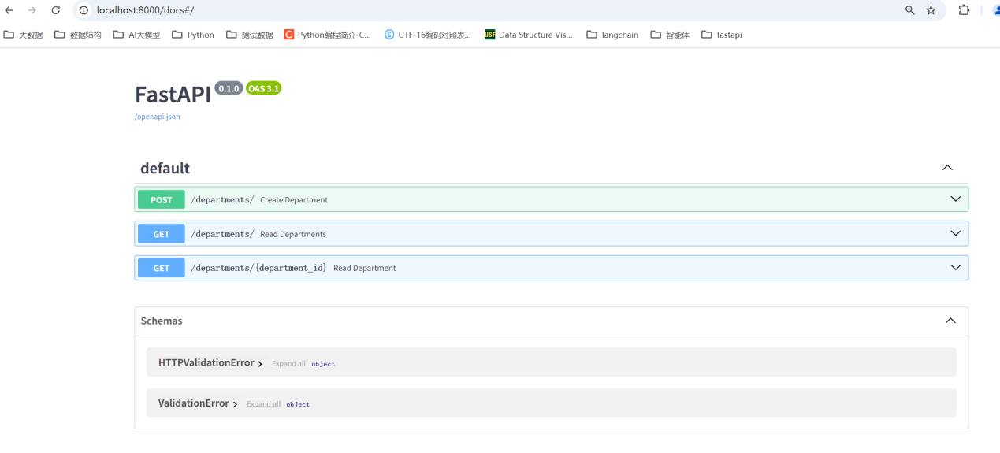

# FastAPI与SQLAlchemy结合案例（扩展）

## 项目结构

```text
myproject/
├── fastapi_sqlalchemy.py         # FastAPI 主应用（接口定义）
├── base.py          # 模型类基类
├── database.py      # 数据库配置（引擎、会话）
└── models.py        # SQLAlchemy 模型（映射 MySQL 表）
```

## 复用第四章定义的base.py、table_2_models.py、database.py

## 创建fastapi_sqlalchemy测试

```python
# main.py
import uvicorn
from fastapi import FastAPI, Depends, HTTPException
from sqlalchemy.orm import Session
from datetime import date

from table_2_models import Departments, Employees
from database import SessionLocal, engine

app = FastAPI()

# 依赖项：获取数据库会话
def get_db():
    db = SessionLocal()
    try:
        yield db
    finally:
        db.close()

# 部门相关接口
@app.post("/departments/")
def create_department(name: str, location: str, db: Session = Depends(get_db)):
    db_department = Departments(name=name, location=location)
    db.add(db_department)
    db.commit()
    db.refresh(db_department)
    return db_department

@app.get("/departments/")
def read_departments(db: Session = Depends(get_db)):
    return db.query(Departments).all()

@app.get("/departments/{department_id}")
def read_department(department_id: int, db: Session = Depends(get_db)):
    department = db.query(Departments).filter(Departments.id == department_id).first()
    if not department:
        raise HTTPException(status_code=404, detail="Department not found")
    return department

if __name__ == "__main__":
    # 直接在代码中启动uvicorn服务器
    uvicorn.run(
        app="fastapi_sqlalchemy:app",       # 指定要运行的FastAPI应用实例
        host="0.0.0.0",  # 允许外部访问（本地可通过127.0.0.1或localhost访问）
        port=8000,     # 端口号
        reload=True    # 开发模式：代码修改后自动重启（生产环境需去掉）
)
```

## 借助apidoc测试接口


